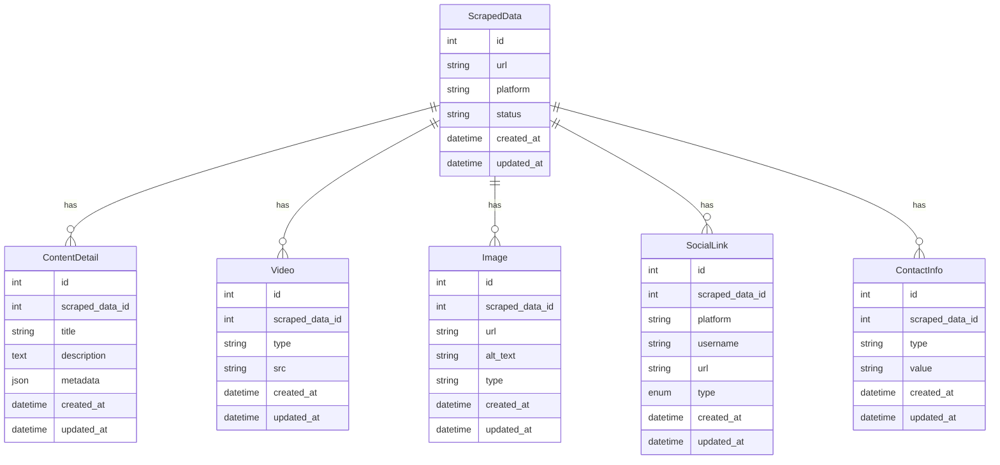

# Portfolio Scraper API

A **Laravel + Next.js** project for scraping online portfolio websites (Canva, Behance, etc.). It extracts metadata, social links, videos, images, descriptions, and contact details into a structured database for viewing via a frontend UI.

---

## Table of Contents
- [Features](#features)
- [Universal Scraper Engine](#universal-scraper-engine)
- [API Endpoints](#api-endpoints)
- [Database Schema](#database-schema)
- [Frontend (Next.js)](#frontend-nextjs)
- [Sample Data Output](#sample-data-output)
- [Setup Instructions](#setup-instructions)

---

## Features
- Scrapes portfolio sites (Canva, Behance, Dribbble, etc.)
- Extracts:
  - Title, descriptions, metadata
  - Images, videos
  - Social links, contact info
  - Content from JSON scripts and HTML
- Stores all data in a relational database
- RESTful API for scraping and retrieving data
- Next.js frontend for viewing and interacting with scraped data

---

## Universal Scraper Engine

The `UniversalScraper` class uses Laravel HTTP and Symfony DomCrawler to extract rich content from any URL:

- **Title, Descriptions, Metadata** from `<title>` and `<meta>` tags
- **Images** from `` tags
- **Videos** from `<video>`, `<iframe>`, and raw links (YouTube, Vimeo)
- **Social Links**: from anchors, JSON blocks, and @username detection
- **Contact Info**: detects emails and social handles from text
- Supports embedded `<script type="application/json">`, fallback regex scraping, and absolute URL correction

---

## API Endpoints

### Scrape New URL
**POST** `/api/scrape`
```json
{
  "url": "https://example.my.canva.site/"
}
```

### Get All Scraped Data
**GET** `/api/scraped-data`

### Get Data by ID
**GET** `/api/scrape/{id}`

#### Example Usage
```bash
curl -s http://127.0.0.1:8000/api/scrape/2 | jq
```

---

## Database Schema

### Entity-Relationship Diagram



### Table Relationships

| Table         | Related Table   | Relationship Type | Foreign Key         |
|---------------|-----------------|------------------|---------------------|
| ScrapedData   | ContentDetail   | 1-to-many        | scraped_data_id     |
| ScrapedData   | Video           | 1-to-many        | scraped_data_id     |
| ScrapedData   | Image           | 1-to-many        | scraped_data_id     |
| ScrapedData   | SocialLink      | 1-to-many        | scraped_data_id     |
| ScrapedData   | ContactInfo     | 1-to-many        | scraped_data_id     |

---

## Frontend (Next.js)

- `/` — Home page with scrape form + all scraped cards
- `/scrape/[id]` — Show page with videos, social links, and metadata
- Fully dynamic UI using React state, styled inline (or with Tailwind/Chakra)

---

## Sample Data Output

```json
{
  "message": "Scraping completed successfully",
  "data": {
    "id": 1,
    "url": "https://myportfoliowebsite01.my.canva.site/",
    "platform": "canva",
    "status": "completed",
    "created_at": "2025-06-06T10:17:12.000000Z",
    "updated_at": "2025-06-06T10:17:12.000000Z",
    "content_detail": {
      "id": 2,
      "scraped_data_id": 1,
      "title": "Portfolio Website by jasmeen josan",
      "description": "Welcome to our invitation card portfolio website! Here, you will find a curated collection of our beautiful and unique invitation card designs.",
      "metadata": {
        "viewport": "width=device-width, initial-scale=1.0",
        "description": "Welcome to our invitation card portfolio website! Here, you will find a curated collection of our beautiful and unique invitation card designs."
      },
      "created_at": "2025-06-06T10:19:04.000000Z",
      "updated_at": "2025-06-06T10:19:04.000000Z"
    },
    "videos": [
      { "id": 10, "scraped_data_id": 1, "type": "video", "src": "https://myportfoliowebsite01.my.canva.site/videos/3840fba9db73da8340a0046a911536ec.mp4", "created_at": "2025-06-06T10:19:05.000000Z", "updated_at": "2025-06-06T10:19:05.000000Z" },
      { "id": 11, "scraped_data_id": 1, "type": "video", "src": "https://myportfoliowebsite01.my.canva.site/videos/d6adf9619753bf1ed965eb04a44c68e5.mp4", "created_at": "2025-06-06T10:19:06.000000Z", "updated_at": "2025-06-06T10:19:06.000000Z" },
      { "id": 12, "scraped_data_id": 1, "type": "video", "src": "https://myportfoliowebsite01.my.canva.site/videos/4bcc3422e08b101339fb49951b5bcc01.mp4", "created_at": "2025-06-06T10:19:07.000000Z", "updated_at": "2025-06-06T10:19:07.000000Z" },
      { "id": 13, "scraped_data_id": 1, "type": "video", "src": "https://myportfoliowebsite01.my.canva.site/videos/f8ec3cbb70b95185a1736594a1a4de34.mp4", "created_at": "2025-06-06T10:19:07.000000Z", "updated_at": "2025-06-06T10:19:07.000000Z" },
      { "id": 14, "scraped_data_id": 1, "type": "video", "src": "https://myportfoliowebsite01.my.canva.site/videos/e4545176c689b21fa92927b8c430bfd7.mp4", "created_at": "2025-06-06T10:19:08.000000Z", "updated_at": "2025-06-06T10:19:08.000000Z" },
      { "id": 15, "scraped_data_id": 1, "type": "video", "src": "https://myportfoliowebsite01.my.canva.site/videos/2415832144ae32eca7afdc3e9ed78bcd.mp4", "created_at": "2025-06-06T10:19:09.000000Z", "updated_at": "2025-06-06T10:19:09.000000Z" },
      { "id": 16, "scraped_data_id": 1, "type": "video", "src": "https://myportfoliowebsite01.my.canva.site/videos/2de902c61208cf1c20f9f355120b92ce.mp4", "created_at": "2025-06-06T10:19:10.000000Z", "updated_at": "2025-06-06T10:19:10.000000Z" },
      { "id": 17, "scraped_data_id": 1, "type": "video", "src": "https://myportfoliowebsite01.my.canva.site/videos/25e15b963237db3f99758d47d5b6bd5b.mp4", "created_at": "2025-06-06T10:19:10.000000Z", "updated_at": "2025-06-06T10:19:10.000000Z" },
      { "id": 18, "scraped_data_id": 1, "type": "video", "src": "https://myportfoliowebsite01.my.canva.site/videos/fd35014d8fa2b96eeaf6de285b1ba0e9.mp4", "created_at": "2025-06-06T10:19:11.000000Z", "updated_at": "2025-06-06T10:19:11.000000Z" }
    ],
    "images": [
      { "id": 24, "scraped_data_id": 1, "url": "https://myportfoliowebsite01.my.canva.site/images/7e755cb3206ae504315c6d4961822385.svg", "alt_text": null, "type": "basic", "created_at": "2025-06-06T10:19:12.000000Z", "updated_at": "2025-06-06T10:19:12.000000Z" },
      { "id": 25, "scraped_data_id": 1, "url": "https://myportfoliowebsite01.my.canva.site/images/4e19fe8a6d44dd9e8f58e5435ca24429.png", "alt_text": null, "type": "basic", "created_at": "2025-06-06T10:19:13.000000Z", "updated_at": "2025-06-06T10:19:13.000000Z" },
      { "id": 26, "scraped_data_id": 1, "url": "https://myportfoliowebsite01.my.canva.site/images/4e19fe8a6d44dd9e8f58e5435ca24429.png", "alt_text": null, "type": "basic", "created_at": "2025-06-06T10:19:13.000000Z", "updated_at": "2025-06-06T10:19:13.000000Z" },
      { "id": 27, "scraped_data_id": 1, "url": "https://myportfoliowebsite01.my.canva.site/images/fd727c7baee7fc0925a6ffea44b2ebe6.png", "alt_text": null, "type": "basic", "created_at": "2025-06-06T10:19:14.000000Z", "updated_at": "2025-06-06T10:19:14.000000Z" },
      { "id": 28, "scraped_data_id": 1, "url": "https://myportfoliowebsite01.my.canva.site/images/d5457ce811498ad4f714477b6000ff67.png", "alt_text": null, "type": "basic", "created_at": "2025-06-06T10:19:15.000000Z", "updated_at": "2025-06-06T10:19:15.000000Z" },
      { "id": 29, "scraped_data_id": 1, "url": "https://myportfoliowebsite01.my.canva.site/images/9e41c777bf19472693843c400dff283c.png", "alt_text": null, "type": "basic", "created_at": "2025-06-06T10:19:16.000000Z", "updated_at": "2025-06-06T10:19:16.000000Z" },
      { "id": 30, "scraped_data_id": 1, "url": "https://myportfoliowebsite01.my.canva.site/images/bdb268a3141c543c48292af98eb70549.svg", "alt_text": null, "type": "basic", "created_at": "2025-06-06T10:19:17.000000Z", "updated_at": "2025-06-06T10:19:17.000000Z" },
      { "id": 31, "scraped_data_id": 1, "url": "https://myportfoliowebsite01.my.canva.site/images/f5dcf87fbcfdb5d2a36a8865ffe7e906.png", "alt_text": null, "type": "basic", "created_at": "2025-06-06T10:19:17.000000Z", "updated_at": "2025-06-06T10:19:17.000000Z" },
      { "id": 32, "scraped_data_id": 1, "url": "https://myportfoliowebsite01.my.canva.site/images/8799bab315c5614febc9b3efb4453f80.png", "alt_text": null, "type": "basic", "created_at": "2025-06-06T10:19:18.000000Z", "updated_at": "2025-06-06T10:19:18.000000Z" },
      { "id": 33, "scraped_data_id": 1, "url": "https://myportfoliowebsite01.my.canva.site/videos/5f6e6389b538c9043a836fe0ef41973a.gif", "alt_text": null, "type": "basic", "created_at": "2025-06-06T10:19:19.000000Z", "updated_at": "2025-06-06T10:19:19.000000Z" },
      { "id": 34, "scraped_data_id": 1, "url": "https://myportfoliowebsite01.my.canva.site/images/a73b539976b47c3ae11f1df054a5507b.png", "alt_text": null, "type": "basic", "created_at": "2025-06-06T10:19:20.000000Z", "updated_at": "2025-06-06T10:19:20.000000Z" },
      { "id": 35, "scraped_data_id": 1, "url": "https://myportfoliowebsite01.my.canva.site/images/d6bb61a1b463a810ea98106cd374f528.png", "alt_text": null, "type": "basic", "created_at": "2025-06-06T10:19:21.000000Z", "updated_at": "2025-06-06T10:19:21.000000Z" },
      { "id": 36, "scraped_data_id": 1, "url": "https://myportfoliowebsite01.my.canva.site/images/bc8200df7a37df5910998047b6aae84e.svg", "alt_text": null, "type": "basic", "created_at": "2025-06-06T10:19:21.000000Z", "updated_at": "2025-06-06T10:19:21.000000Z" },
      { "id": 37, "scraped_data_id": 1, "url": "https://myportfoliowebsite01.my.canva.site/images/46c82c849d24f2c7e032008459a321f2.svg", "alt_text": null, "type": "basic", "created_at": "2025-06-06T10:19:22.000000Z", "updated_at": "2025-06-06T10:19:22.000000Z" },
      { "id": 38, "scraped_data_id": 1, "url": "https://myportfoliowebsite01.my.canva.site/images/de56e3d417cdb4b44f7986601551eeed.png", "alt_text": null, "type": "basic", "created_at": "2025-06-06T10:19:23.000000Z", "updated_at": "2025-06-06T10:19:23.000000Z" },
      { "id": 39, "scraped_data_id": 1, "url": "https://myportfoliowebsite01.my.canva.site/images/4e19fe8a6d44dd9e8f58e5435ca24429.png", "alt_text": null, "type": "basic", "created_at": "2025-06-06T10:19:24.000000Z", "updated_at": "2025-06-06T10:19:24.000000Z" },
      { "id": 40, "scraped_data_id": 1, "url": "https://myportfoliowebsite01.my.canva.site/images/4e19fe8a6d44dd9e8f58e5435ca24429.png", "alt_text": null, "type": "basic", "created_at": "2025-06-06T10:19:24.000000Z", "updated_at": "2025-06-06T10:19:24.000000Z" },
      { "id": 41, "scraped_data_id": 1, "url": "https://myportfoliowebsite01.my.canva.site/images/989471f20a6d848ec07a02b2544e6dc8.png", "alt_text": null, "type": "basic", "created_at": "2025-06-06T10:19:25.000000Z", "updated_at": "2025-06-06T10:19:25.000000Z" },
      { "id": 42, "scraped_data_id": 1, "url": "https://myportfoliowebsite01.my.canva.site/images/05291419800d00c6c7c320594d9bb0cf.png", "alt_text": null, "type": "basic", "created_at": "2025-06-06T10:19:26.000000Z", "updated_at": "2025-06-06T10:19:26.000000Z" },
      { "id": 43, "scraped_data_id": 1, "url": "https://myportfoliowebsite01.my.canva.site/images/5925955da79fde824af920e05432778e.svg", "alt_text": null, "type": "basic", "created_at": "2025-06-06T10:19:27.000000Z", "updated_at": "2025-06-06T10:19:27.000000Z" }
    ],
    "social_links": [],
    "contact_infos": []
  }
}
```

---

## Setup Instructions

### 1. Clone the Repository
```bash
git clone <your-repo-url>
```

### 2. Backend (Laravel API)
```bash
cd scraping-api
cp .env.example .env
composer install
php artisan key:generate
php artisan migrate
php artisan serve
```
- Make sure your `.env` is set up for your DB. If you need a working `.env`, contact the author.
- The API will run at [http://127.0.0.1:8000](http://127.0.0.1:8000)

### 3. Frontend (Next.js)
```bash
cd ../scraping-frontend
npm install
npm run dev
```
- The frontend will run at [http://localhost:3000](http://localhost:3000)

---
