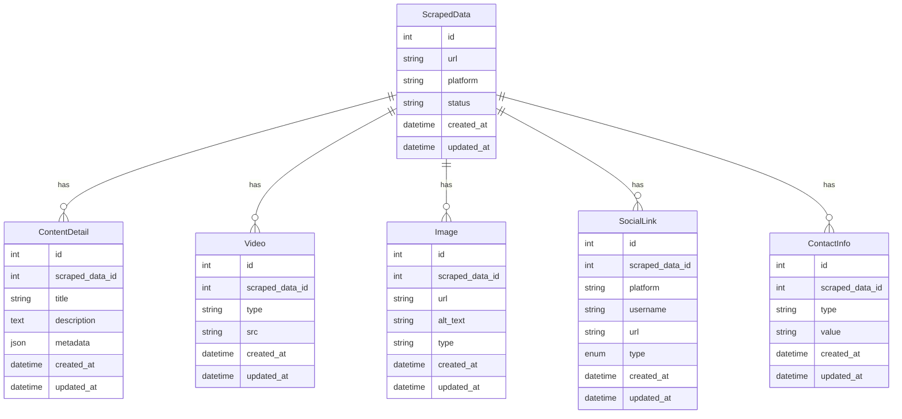

# Portfolio Scraper API

A **Laravel + Next.js** project for scraping online portfolio websites (Canva, Behance, etc.). It extracts metadata, social links, videos, images, descriptions, and contact details into a structured database for viewing via a frontend UI.

---

## Table of Contents
- [Features](#features)
- [Universal Scraper Engine](#universal-scraper-engine)
- [API Endpoints](#api-endpoints)
- [Database Schema](#database-schema)
- [Frontend (Next.js)](#frontend-nextjs)
- [Sample Data Output](#sample-data-output)
- [Setup Instructions](#setup-instructions)

---

## Features
- Scrapes portfolio sites (Canva, Behance, Dribbble, etc.)
- Extracts:
  - Title, descriptions, metadata
  - Images, videos
  - Social links, contact info
  - Content from JSON scripts and HTML
- Stores all data in a relational database
- RESTful API for scraping and retrieving data
- Next.js frontend for viewing and interacting with scraped data

---

## Universal Scraper Engine

The `UniversalScraper` class uses Laravel HTTP and Symfony DomCrawler to extract rich content from any URL:

- **Title, Descriptions, Metadata** from `<title>` and `<meta>` tags
- **Images** from `` tags
- **Videos** from `<video>`, `<iframe>`, and raw links (YouTube, Vimeo)
- **Social Links**: from anchors, JSON blocks, and @username detection
- **Contact Info**: detects emails and social handles from text
- Supports embedded `<script type="application/json">`, fallback regex scraping, and absolute URL correction

---

## API Endpoints

### Scrape New URL
**POST** `/api/scrape`
```json
{
  "url": "https://example.my.canva.site/"
}
```

### Get All Scraped Data
**GET** `/api/scraped-data`

### Get Data by ID
**GET** `/api/scrape/{id}`

#### Example Usage
```bash
curl -s http://127.0.0.1:8000/api/scrape/2 | jq
```

---

## Database Schema

### Entity-Relationship Diagram



### Table Relationships

| Table         | Related Table   | Relationship Type | Foreign Key         |
|---------------|-----------------|------------------|---------------------|
| ScrapedData   | ContentDetail   | 1-to-many        | scraped_data_id     |
| ScrapedData   | Video           | 1-to-many        | scraped_data_id     |
| ScrapedData   | Image           | 1-to-many        | scraped_data_id     |
| ScrapedData   | SocialLink      | 1-to-many        | scraped_data_id     |
| ScrapedData   | ContactInfo     | 1-to-many        | scraped_data_id     |

---

## Frontend (Next.js)

- `/` — Home page with scrape form + all scraped cards
- `/scrape/[id]` — Show page with videos, social links, and metadata
- Fully dynamic UI using React state, styled inline (or with Tailwind/Chakra)

---

## Sample Data Output

```json
{
  "data": {
    "id": 2,
    "url": "https://sonuchoudhary.my.canva.site/portfolio",
    "platform": "canva",
    "content_detail": {
      "title": "SONU CHOUDHARY PORTFOLIO",
      "description": "i am professional video editor...",
      "metadata": {
        "description": "...",
        "og:title": "..."
      }
    },
    "videos": [
      { "src": "https://youtu.be/B6yRSDWiou4" }
    ],
    "images": [],
    "social_links": [
      { "platform": "instagram", "username": "theeditingentrepreneur" }
    ],
    "contact_infos": [
      { "type": "email", "value": "jabsvideo19@gmail.com" }
    ]
  }
}
```

---

## Setup Instructions

### 1. Clone the Repository
```bash
git clone <your-repo-url>
```

### 2. Backend (Laravel API)
```bash
cd scraping-api
cp .env.example .env
composer install
php artisan key:generate
php artisan migrate
php artisan serve
```
- Make sure your `.env` is set up for your DB. If you need a working `.env`, contact the author.
- The API will run at [http://127.0.0.1:8000](http://127.0.0.1:8000)

### 3. Frontend (Next.js)
```bash
cd ../scraping-frontend
npm install
npm run dev
```
- The frontend will run at [http://localhost:3000](http://localhost:3000)

---
